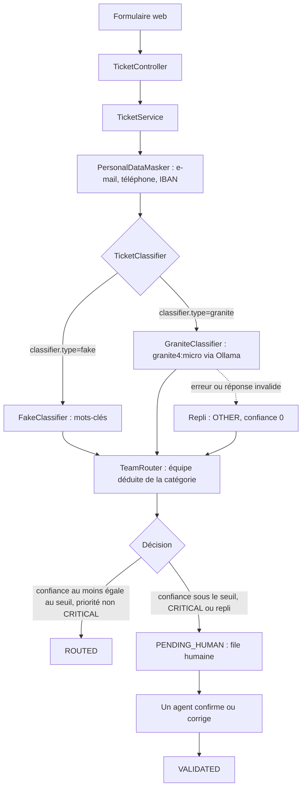

# ticket-triage

Prototype de tri et de routage de tickets de support IT pour un grand compte (banque ou assurance), réalisé pour un exercice IBM Client Engineering. Un ticket en texte libre reçoit une catégorie, une priorité, une équipe, un résumé, une justification et un niveau de confiance. Sous le seuil de confiance, en priorité CRITICAL ou si le modèle échoue, il part dans une file de validation humaine.

Stack : Java 21, Spring Boot 3, Maven, LangChain4j, Ollama (granite4:micro, en local), H2 en mémoire, Thymeleaf, JUnit 5.

## Prérequis

- JDK 21 et Maven 3.9+.
- Mode granite uniquement : Ollama lancé, avec le modèle téléchargé par `ollama pull granite4:micro`.
- Aucune clé d'API, aucun service cloud.

## Lancement (Windows PowerShell)

```powershell
chcp 65001   # console en UTF-8, pour lire les accents des lignes [TRIAGE]

# Mode fake : classification par mots-clés, sans IA (mode par défaut)
mvn spring-boot:run

# Mode granite : granite4:micro via Ollama (les guillemets évitent que PowerShell découpe l'argument)
mvn spring-boot:run "-Dspring-boot.run.arguments=--classifier.type=granite"
```

Application sur http://localhost:8080 (soumission) et http://localhost:8080/human-queue (file humaine). Un ticket vide ou plus long que `ticket.max-length` (5000 caractères par défaut) est refusé sur le formulaire, sans appel au modèle.

Variante à partir du jar, par exemple pour garder une instance de secours en mode fake sur un autre port :

```powershell
mvn verify
java -jar target\ticket-triage-0.1.0-SNAPSHOT.jar --classifier.type=granite
java -jar target\ticket-triage-0.1.0-SNAPSHOT.jar --classifier.type=fake --server.port=8081
```

Chaque soumission écrit dans la console des lignes `[TRIAGE]` : classifieur utilisé, texte masqué envoyé au modèle (jamais le texte original), réponse brute du modèle, temps de réponse, résultat typé et décision avec sa raison.

## Tests

```powershell
mvn verify                                        # tests unitaires et web, sans Ollama
$env:OLLAMA_IT='true'; mvn test -Pollama-live     # test contre le vrai Ollama (Ollama doit tourner)
```

Le détail des classes de test figure dans [Choix et justifications › Tests](#tests-1).

## Flux de traitement



Le modèle ne choisit jamais l'équipe : elle est déduite de la catégorie par une table Java. Les catégories et priorités sont des listes fermées (enums).

## Choix et justifications

### Modèle
granite4:micro, de la famille Granite d'IBM, open source (licence Apache 2.0), environ 3 milliards de paramètres (3,4 G, quantifié en Q4_K_M, 2,1 Go sur disque). Il est exécuté en local via Ollama, en inférence seule : aucun entraînement ni ajustement. Toutes les données de test sont synthétiques.

### Confiance
C'est un score auto-déclaré par le modèle dans sa réponse JSON. Il n'est pas calibré. Le seuil est configurable (`classifier.confidence-threshold`, 0,7 par défaut). Les garde-fous structurels n'en dépendent pas : listes fermées de catégories et de priorités, équipe déduite par une table Java, priorité CRITICAL et réponses invalides toujours envoyées en file humaine.

### Java 21 plutôt que 25
Les deux sont des versions LTS. Java 21 est la plus déployée chez les clients et elle est validée par tout l'écosystème utilisé ici. Une incompatibilité d'un outil de test a été rencontrée sur Java 25. La migration vers 25 serait triviale.

### Spring Boot 3 plutôt que 4
Spring Boot 4 est une version majeure récente qui change le socle. Pour un prototype réalisé en deux jours, la version stable a été retenue ; les starters LangChain4j visent Spring Boot 3. La montée de version est prévue.

### LangChain4j plutôt que Spring AI
Les deux conviennent. LangChain4j a été retenu pour ses modules Ollama et watsonx.ai et pour son indépendance vis-à-vis du framework. Spring AI serait aussi défendable.

### H2 plutôt que PostgreSQL
H2 ne demande aucune installation et l'application se lance en une commande. Le code JPA est le même qu'avec PostgreSQL.

### Tests
`mvn verify` exécute les classes suivantes, sans Ollama :

| Classe | Ce qu'elle couvre |
|---|---|
| `ClassificationResultTest` | Contrat du résultat de classification : champs obligatoires et confiance dans [0 ; 1] (NaN et 95 refusés). |
| `FakeClassifierTest` | Règles par mots-clés : réseau, accès, sécurité prioritaire sur réseau et mot de passe (phishing, ransomware), texte sans mot-clé en OTHER sous le seuil, entrée nulle. |
| `ClassificationResultParserTest` | Lecture de la réponse JSON du modèle : conversion en résultat typé (valeurs en minuscules acceptées), rejet d'un JSON malformé, d'une catégorie ou priorité inconnue, d'une confiance hors plage, d'un résumé absent et d'un champ inconnu. |
| `GraniteClassifierTest` | GraniteClassifier avec un modèle de langage simulé : réponse valide convertie en résultat typé, cas VPN, propagation des erreurs (JSON malformé, modèle injoignable), masquage des données avant l'envoi, refus d'une URL ou d'un nom de modèle vide et d'un délai nul ou négatif. |
| `PersonalDataMaskerTest` | Masquage des e-mails, téléphones français et IBAN (compacts et espacés, égalité stricte), texte sans donnée personnelle inchangé, non-régression sur des codes techniques (SRV01, PC75, KB5034441, INC0012345, Office365, Win11). |
| `TeamRouterTest` | Chaque catégorie a une équipe. |
| `TicketServiceTest` | Décision de routage : au-dessus, en dessous et au niveau du seuil, CRITICAL toujours en file humaine, validation humaine, repli en file humaine sur erreur réseau et sur confiance hors de [0 ; 1]. |
| `TicketControllerTest` | Contexte Spring complet (H2, FakeClassifier) : création d'un ticket, texte vague en file humaine, page du ticket avec le texte envoyé au modèle, validation redirigée vers le ticket en VALIDATED, ticket vide ou de plus de 5000 caractères refusé sur le formulaire sans appel au modèle, attribut maxlength, réponse 404 pour un ticket inconnu (affichage et validation), pages d'accueil et de file humaine. |

Hors `mvn verify`, `GraniteClassifierOllamaIT` interroge le vrai modèle (Ollama doit tourner) : `$env:OLLAMA_IT='true'; mvn test -Pollama-live`.

## Limites

- **Confiance non calibrée** : c'est une auto-évaluation du modèle ; une catégorie fausse a déjà été observée avec 0,95. Le seuil de 0,7 est une valeur de départ, non mesurée.
- **Qualité non mesurée** : aucun jeu de tickets étiquetés ; le test live reprend un exemple du prompt et ne sert que de test de fumée.
- **Masquage par expressions régulières** : e-mails, téléphones français et IBAN écrits en majuscules seulement ; ni cartes bancaires, ni noms, ni adresses. Le texte original reste stocké et affiché à l'agent.
- **Prototype sans authentification** : ni connexion ni CSRF, console H2 ouverte, base en mémoire vidée à chaque redémarrage.
- **Injection de prompt** : atténuée par la structure (enums, équipe par table, CRITICAL et échecs vers un humain), non testée contre le modèle.
- **Latence** : sur CPU, environ 19 s au premier appel à froid (mesuré) et une dizaine de secondes ensuite, en appel synchrone. Ollama décharge le modèle après 5 min d'inactivité, sauf si `OLLAMA_KEEP_ALIVE` est défini.

Pistes : jeu d'évaluation étiqueté et calibration du seuil, sortie JSON contrainte avec température nulle, reconnaissance d'entités nommées pour le masquage, base persistante, authentification, traitement asynchrone.
