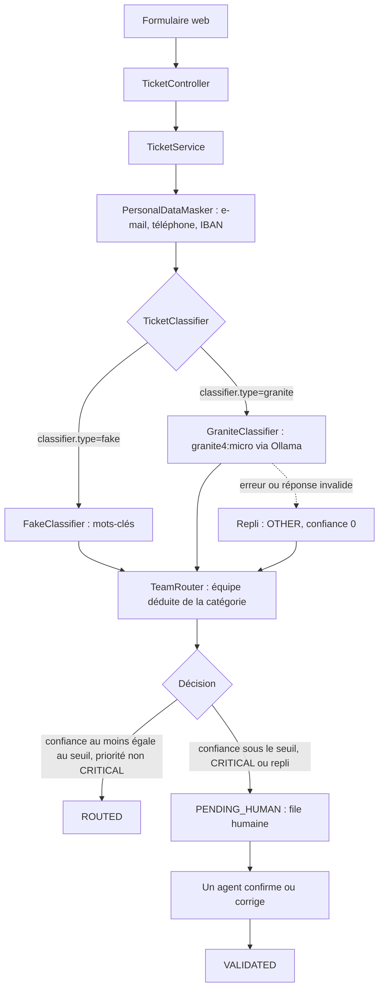

# ticket-triage

Prototype de tri et de routage de tickets de support IT pour un grand compte (banque ou assurance), réalisé pour un exercice IBM Client Engineering. Un ticket en texte libre reçoit une catégorie, une priorité, une équipe, un résumé, une justification et un niveau de confiance. Sous le seuil de confiance, en priorité CRITICAL ou si le modèle échoue, il part dans une file de validation humaine.

Stack : Java 21, Spring Boot 3, Maven, LangChain4j, Ollama (granite4:micro, en local), H2 en mémoire, Thymeleaf, JUnit 5.

## Prérequis

- JDK 21 et Maven 3.9+.
- Mode granite uniquement : Ollama lancé, avec le modèle téléchargé par `ollama pull granite4:micro`.
- Aucune clé d'API, aucun service cloud.

## Lancement (Windows PowerShell)

```powershell
chcp 65001   # console en UTF-8, pour lire les accents des lignes [TRIAGE]

# Mode fake : classification par mots-clés, sans IA (mode par défaut)
mvn spring-boot:run

# Mode granite : granite4:micro via Ollama (les guillemets évitent que PowerShell découpe l'argument)
mvn spring-boot:run "-Dspring-boot.run.arguments=--classifier.type=granite"
```

Application sur http://localhost:8080 (soumission) et http://localhost:8080/human-queue (file humaine).

Variante à partir du jar, par exemple pour garder une instance de secours en mode fake sur un autre port :

```powershell
mvn verify
java -jar target\ticket-triage-0.1.0-SNAPSHOT.jar --classifier.type=granite
java -jar target\ticket-triage-0.1.0-SNAPSHOT.jar --classifier.type=fake --server.port=8081
```

Chaque soumission écrit dans la console des lignes `[TRIAGE]` : classifieur utilisé, texte masqué envoyé au modèle (jamais le texte original), réponse brute du modèle, temps de réponse, résultat typé et décision avec sa raison.

## Tests

```powershell
mvn verify                                        # tests unitaires et web, sans Ollama
$env:OLLAMA_IT='true'; mvn test -Pollama-live     # test contre le vrai Ollama (Ollama doit tourner)
```

## Flux de traitement



Le modèle ne choisit jamais l'équipe : elle est déduite de la catégorie par une table Java. Les catégories et priorités sont des listes fermées (enums).

## Limites

- **Confiance non calibrée** : c'est une auto-évaluation du modèle ; une catégorie fausse a déjà été observée avec 0,95. Le seuil de 0,7 est une valeur de départ, non mesurée.
- **Qualité non mesurée** : aucun jeu de tickets étiquetés ; le test live reprend un exemple du prompt et ne sert que de test de fumée.
- **Masquage par expressions régulières** : e-mails, téléphones français et IBAN écrits en majuscules seulement ; ni cartes bancaires, ni noms, ni adresses. Le texte original reste stocké et affiché à l'agent.
- **Prototype sans authentification** : ni connexion ni CSRF, console H2 ouverte, base en mémoire vidée à chaque redémarrage.
- **Injection de prompt** : atténuée par la structure (enums, équipe par table, CRITICAL et échecs vers un humain), non testée contre le modèle.
- **Latence** : sur CPU, environ 19 s au premier appel à froid (mesuré) et une dizaine de secondes ensuite, en appel synchrone. Ollama décharge le modèle après 5 min d'inactivité, sauf si `OLLAMA_KEEP_ALIVE` est défini.

Pistes : jeu d'évaluation étiqueté et calibration du seuil, sortie JSON contrainte avec température nulle, reconnaissance d'entités nommées pour le masquage, base persistante, authentification, traitement asynchrone.
